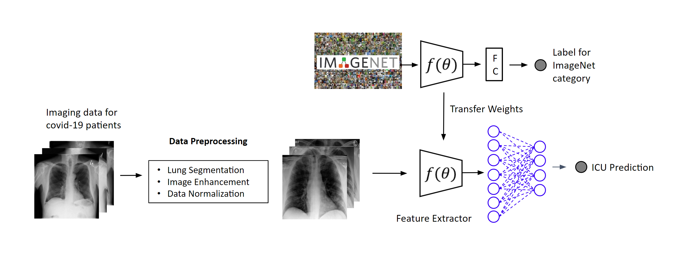
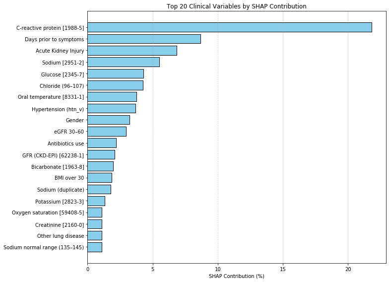

# XAI-MML-ICU: Explainable Multimodal Machine Learning for ICU Admission Prediction
This repository contains the experimental codebase for the research paper:

"Explainable Multimodal Machine Learning Model for Predicting Intensive Care Unit Admission"
by S.Kizilisik, A.Terzi, M.Koc and S.Candemir

---


**📄 Abstract**
Timely prediction of Intensive Care Unit (ICU) admission is crucial for optimizing clinical decision-making and resource management, especially in high-pressure healthcare settings. This study investigates the effectiveness of a multimodal machine learning framework that integrates imaging data and clinical data—including vital signs, laboratory results, and co-morbidities—to predict the ICU requirement of COVID-19 patients at the time of hospital admission. Utilizing a publicly available dataset, we implemented a pipeline that includes lung region segmentation, data preprocessing and augmentation, and feature learning via a pre-trained convolutional neural network architecture. The multimodal model, trained with focal loss to address class imbalance, achieved an area under the receiver operating characteristic curve of 0.96. To interpret the model’s decision, we used Gradient-weighted Class Activation Mapping to visualize salient lung regions and SHapley Additive exPlanations to assess the individual importance of clinical features. The most influential predictors included C-reactive protein, creatinine, eGFR, glucose, and symptom duration, consistent with findings from correlation analysis. The results validate the clinical relevance of our approach, which offers a transparent and effective tool for early ICU risk stratification using data commonly available upon admission.

---


**✨ Key Features & Methodology**
* **Multimodal Data Fusion:** Fusion of imaging data (Chest X-rays) and diverse clinical data (vital signs, lab results, co-morbidities).
* **Automated Lung Region Segmentation:** Preprocessing to isolate irrelevant lung areas from imaging data.
* **Robust Data Augmentation:** Techniques to enhance dataset diversity and model generalization.
* **Feature Learning:** Extracts powerful features from imaging data using the pre-trained **MobileNetV3Small Convolutional Neural Network (CNN) architecture**, specifically chosen for its efficiency, mobility, and portability.
* **Class Imbalance Handling:** Employs Focal Loss during training to effectively address imbalanced datasets, common in medical prediction tasks.
  
<!-- Full-width image in its own row -->
<div style="text-align: center; margin-top: 20px;">
  
</div>
---


**💡 Explainable AI (XAI):**

* **Gradient-weighted Class Activation Mapping (Grad-CAM):** For visualizing salient regions in Chest X-rays that contribute to the model's decision.

* **SHapley Additive exPlanations (SHAP):** For quantifying the individual importance and impact of clinical features on predictions.

* **Key Predictor Identification:** Identifies clinically relevant features such as C-reactive protein, creatinine, Sodium, glucose, and symptom duration as influential predictors.

<div style="display: flex; gap: 10px; justify-content: center;">
  
  
</div>

# 🚀 Performance
## CXR Model

<div style="display: flex; gap: 10px; width: 100%; align-items: center; flex-wrap: nowrap; overflow-x: auto;">
  
  
  
</div>
---

## Clinic Model

<div style="display: flex; gap: 10px; align-items: center;">
  
  
  
</div>

---

## Multimodal Fused Approach

<!-- First row: 3 images side by side -->
<div style="display: flex; gap: 10px; justify-content: center; margin-bottom: 20px;">
  
  
  
</div>


---

## Comparison Table

| Model                       | Accuracy | Precision | Recall |   F1   |   AUC   |    Score Notes     |
|-----------------------------|----------|-----------|--------|--------|---------|--------------------|
| CXR Model(MobilenetV3 Small)| 0.875     | 0.847      | 0.871   | 0.857   | 0.929    |Baseline image-only |
| Clinic Model                | 0.807     | 0.771      | 0.792   | 0.779   | 0.866    |Clinical data only  |
| Multimodal Model            | 0.902     | 0.875      | 0.909   | 0.888   | 0.957    |Fusion of both data |


# 🛠️ Getting Started
Prerequisites can be found in env_backup.yaml file

Git

Installation
Clone the repository:
```
git clone git@github.com:Akaqox/ICU-MML-XAI.git
cd ICU-MML-XAI
```

Install dependencies:
It is highly recommended to use a virtual environment such as conda.
```

conda update -n base -c defaults conda
conda env create -f env_backup.yaml -n YOUR_ENV_NAME
conda activate YOUR_ENV_NAME


```
**Configuration:**
The project uses a config.json file for hyperparameters and paths. Ensure you review and update config["paths"]["PATH"] and other relevant settings before running.

Example config.json structure for first run
```
runningConfig:
  augmentation: 1
  segmentation: 1
  construct_dataset: 1
  train: 1
paths:
      "PATH": "",
    "dataset": "dataset/",

```
**Usage**
The main pipeline is controlled by the runningConfig flags in config.json. Set True for stages you wish to execute.

To run the full pipeline (or selected stages):
```
python main.py
```
The main.py script orchestrates the following stages based on your config.json:

Processing and Augmentation Stage: Loads data and performs data augmentation.
```
if runningConfig["augmentation"] == True:
    # ... augmentation logic
```
Segmentation Stage: Performs lung region segmentation and cropping (there some adjustable options in config file).
```
if runningConfig["segmentation"] == True:
    # ... segmentation logic
```
Dataset Construction Stage: Constructs the final dataset for training.
```
if runningConfig["construct_dataset"] == True:
    # ... dataset construction logic
```
Training Stage: Initiates the model training and evaluation process automatically. The provided code runs the training loop 50 times for experimental purposes and .
```
if runningConfig["train"] == True:
    for i in range(50):
        # train.fit()
```
**📊 Dataset**
COVID-19-NY-SBU

**📝 Citation**
This code is provided for research purposes only. If you use any part of this codebase or the methodology described, please cite the following paper:
```
(TO BE UPDATED)
@article{Kizilisik_ICU_Prediction,
  author={Kizilisik, S. and Terzi, A. and Koc, M and  Candemir, S.},
  title={Explainable Multimodal Machine Learning Model for Predicting Intensive Care Unit Admission},
  journal={Journal Name (e.g., IEEE Transactions on Medical Imaging)},
  year={Year of Publication}, # e.g., 2024
  volume={Volume Number},
  number={Issue Number},
  pages={Page Range},
  doi={DOI Link} # e.g., 10.1109/TMI.2024.XXXXXXX
}
```


# ✉️ Contact
Salih Kızılışık, Sema Candemir are with the Artificial Intelligence in
Healthcare Laboratory, Computer Engineering Department, Eskisehir Technical University, Eskişehir, TURKEY e-mail: salihk@ogr.eskisehir.edu.tr,
semacandemir@eskisehir.edu.tr

Corresponding author:SemaCandemir
(e-mail:semacandemir@eskisehir.edu.tr).


# ⚖️ License
This project is licensed under the MIT License. See the [LICENSE](/LICENSE) file for details.
